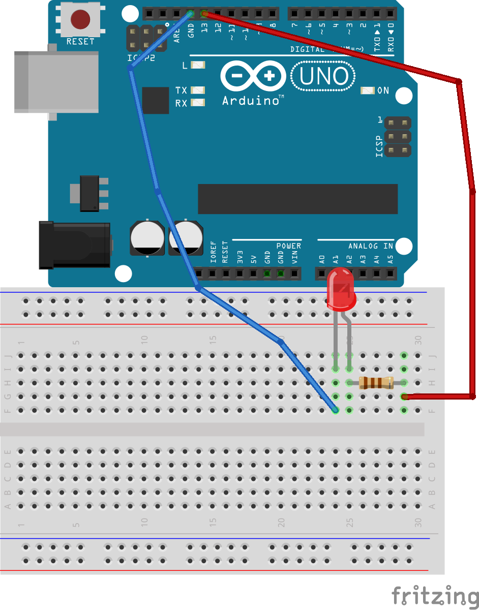

# Hello World
Basic project that gives you fundamentals that you need to 
understand in order to get going with Arduino
## Content
 - Parts required
 - Diagram
 - Instructions

### Parts required
----
1. Arduino Uno or Compatible board
2. Bread board
3. LED (one is enough)
4. 110ohm resistor (or more)
4. M-M Jumper cable x 2

### Diagram
----

Connect Ground pin of Arduino(GND) to cathode of LED and pin 13 
of board to anode of LED through 110ohm (or more) resistor. Usage of this
resistor ensure correct amount of current flows through LED. This avoid 
board from being overloaded.

### Instructions
----
1. First connect items correctly as shown in the diagram. Be sure everything
connect correctly.

2. Open code for Hello World project using Arduino IDE.

3. Then connect board to computer using USB cable.

4. Upload the code to board using upload button. 

You can see LED blinking. If so congratulation. You have successfully
completed your first project.

### Next Step
----
In this project we use a pin the board and we just give 5v and 0v with a delay 
in between. Try to change the value in delay(int) method and see the output.