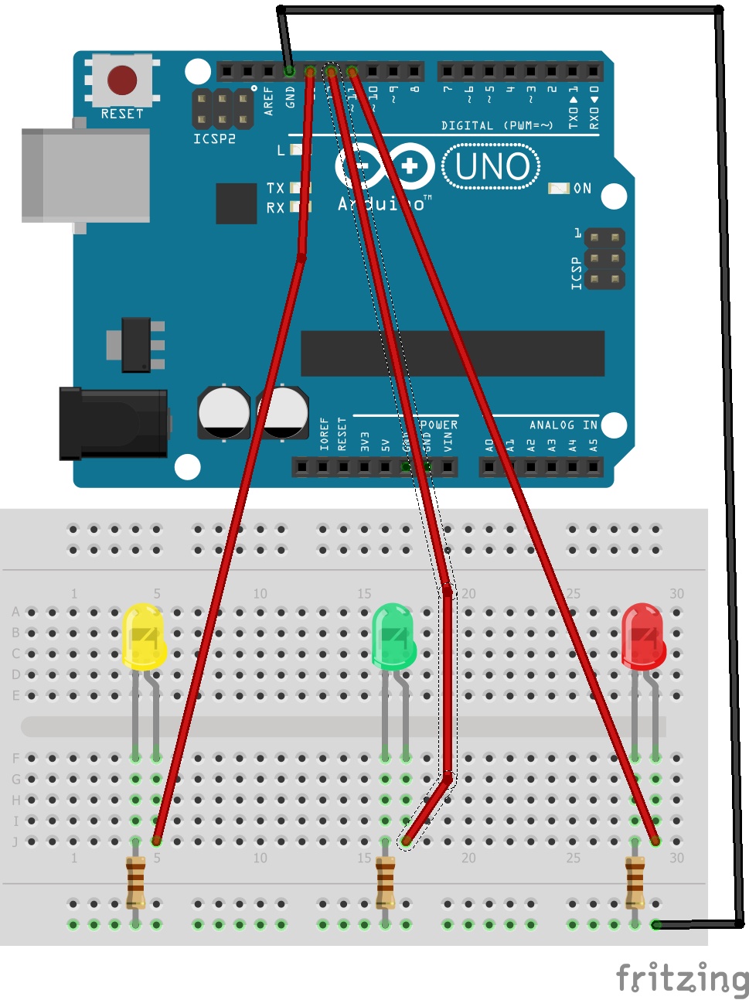

# Hello World 2
This project will use basics we learnt from Hello World project and extend it 
to the next level. This Project use same concept and only difference is we use more
LEDs.
## Content
 - Parts required
 - Diagram
 - Instructions

### Parts required
----
1. Arduino Uno or Compatible board
2. Bread board
3. LED x 3
4. 110ohm resistor x 3
5. M-M Jumper cable x 4

### Diagram
----

Connect Ground pin of Arduino(GND) to cathode of LED and pin 13, 12 and 11
of board to anodes of LEDs through 110ohm resistor. 

### Instructions
----
1. First connect items correctly as shown in the diagram. Be sure everything
connect correctly.

2. Open code for Hello World 2 project using Arduino IDE.

3. Then connect board to computer using USB cable.

4. Upload the code to board using upload button. 

You can see all the LEDs are blinking in a sequence. If so congratulation. You have successfully
completed your second project.

### Next Step
----
In this project we use different pins and use each pin to handle different LED.
You can also see how to use functions with the projects. Although it is not different when it compared 
to C++ it's is a good practice to use functions appropriately to manage the code and 
re-use code. Try to learn the concepts introduced this project and try to create
different patterns. 