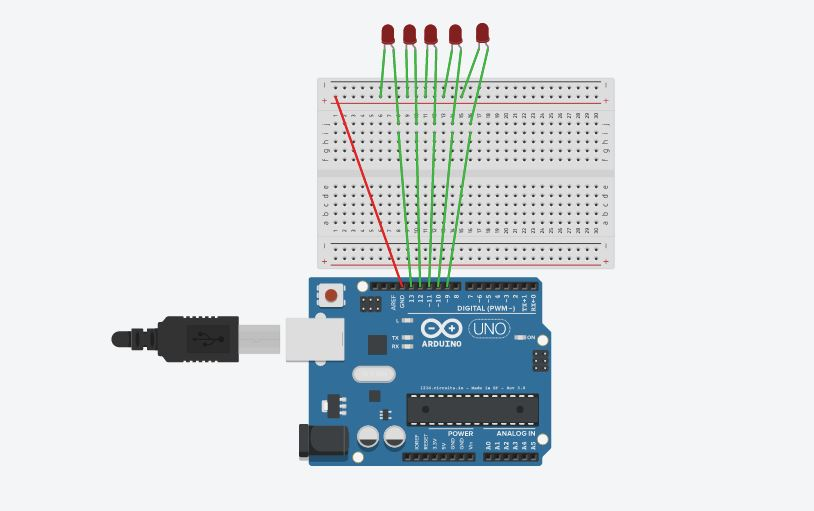

# Knight Rider
Simple program to simulate knight rider led illumination
## Content
 - Parts required
 - Diagram
 - Instructions

### Parts required
----
1. Arduino Uno or Compatible board
2. Bread board
3. LED X 5
4. M-M Jumper cable x 5

### Diagram
----

Complete the circuit using the diagram shown below.
Place LED's in the bread board and all the (-) side of led's should be placed on the same cloumn so they all can access by 
one GND pin.

### Instructions
----
1. Make sure the diagram matches your circuit.

2. Open the code given in arduino IDE.

3. Connent the USB and and verify the code.

4. Upload the code to board using upload button. 

Your mini-Knight Rider is working now.

### Post Script
----
Understand the coding concepts of Arduino, How to define  Arrays and loops which will help you in future Arduino coding.
Following code explains how to initialize set of pins in one line using an array.
int pins[] ={9,10,11,12,13};
Following code will show how to define those pins as the INPUT and OUTPUT.

void setup() {
    for (int i=9;i<14;i++) {
    pinMode(pins[i], OUTPUT);
    }
